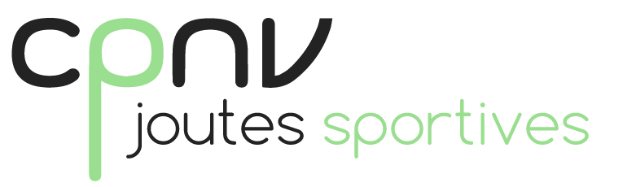

# Joutes 2021 - Fonctionnalités

Ce document contient la liste de toutes les fonctionnalités de l'application joutes.  
Elle est scindée en trois sous-listes: 
1. Celles que l'on considère comme actuellement valides
1. Celles qui sont en cours de développement
1. Celles que l'on prévoit de développer ensuite  

## Rôles des utilisateurs
Pour exprimer les fonctionnalités, il est nécessaire de définir les rôles entre lesquels les utilisateurs se répartissent:

- **Visiteur:** N'importe quel personne pouvant s'authentifier sur le réseau du CPNV
- **Participant:** Participe aux joutes
- **Scribe:** Saisit les résultats des matchs et ferme les poules après la fin des matches
- **Organisateur:** Gère les événements, les tournois, les poules, les phases,...
- **Administrateur:** Gère les aspect techniques de l'application

## Fonctionnalités actuelles

- Voir la liste des événements
- Voir les tournois d'un événement
- Voir les poules d'un tournoi, leurs matches, leurs classements 
- Créer un nouvel événement
- Gérer la liste des sports
- Gérer la liste des terrains
- Créer un tournoi complexe fait de phases successives constituées d'un nombre variable de poules

## En cours de développement

- Améliorations graphiques (couleurs)
- Fermeture d'une poule
- Edition d'une poule
- Duplication de tournois: on recopie une structure de tournoi d'un événement à l'autre
- Edition des matches (organisation)

## A venir
- Authentification externe (CPNV / Azure)
- Attribution de rôles aux utilisateurs par l'organisateur
- Création d'équipes dans un tournoi par les participants
- Validation du nom équipe par l'organisateur
- Vérification de l'occupation de chaque participant sur toute la journée
- Enregistrement des résultats par le scribe
- Grand affichage
