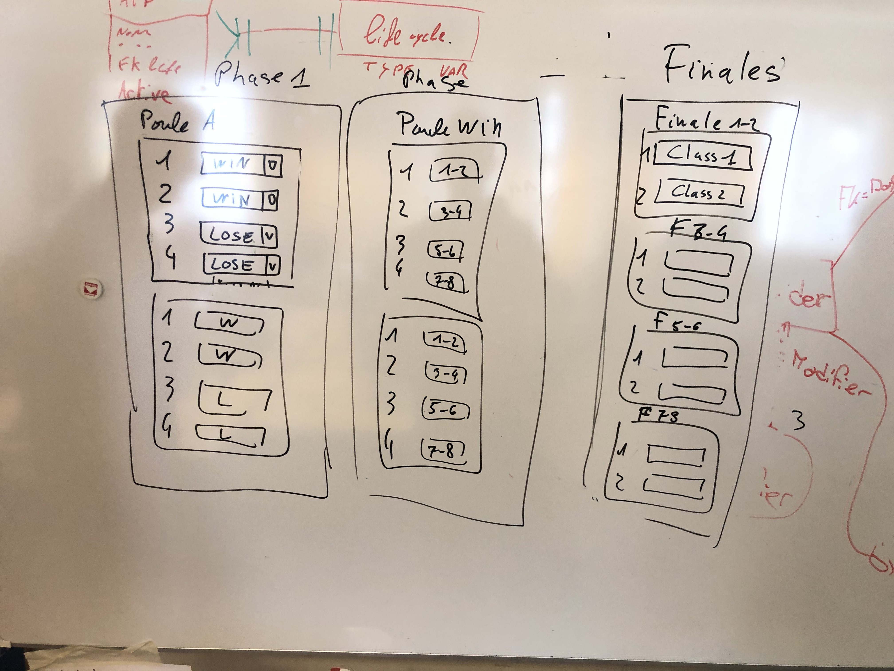

Prise en charge le 17.12.2019, par ansermgw

# Analyse du problème

## Fonctionnement actuel

L'application joute n'a jamais permis d'éditer un nouveau tournoi.

## Description du problème

Le responsable technique en a marre de faire des scripts SQL pour créer les tournois et 
voudrais que le prof de sport puissent créer ses tournois lui-même.
On veut pouvoir créer des tournois depuis un interface graphique,
en configurant le nombre de phases, de pools par phase, de contenders par pool et 
dans quel pool va aller le contender a la fin de la phase.

[Exemple de tournois](../TournoiBad.pdf)

## Description de la solution

(Terminé, le 17.12.2019)

# Plan d'intervention

(Terminé, le ...)

# Exécution

***17.12.2019*** début de la réflexion sur l'implémentation de la solution

## Tests

(Terminés, le ...)

# Commit / Merge

(Fait, le ...)

# Revue de code

(Effectuée, le ...)

# Documentation

(Mise à jour, le ...)
